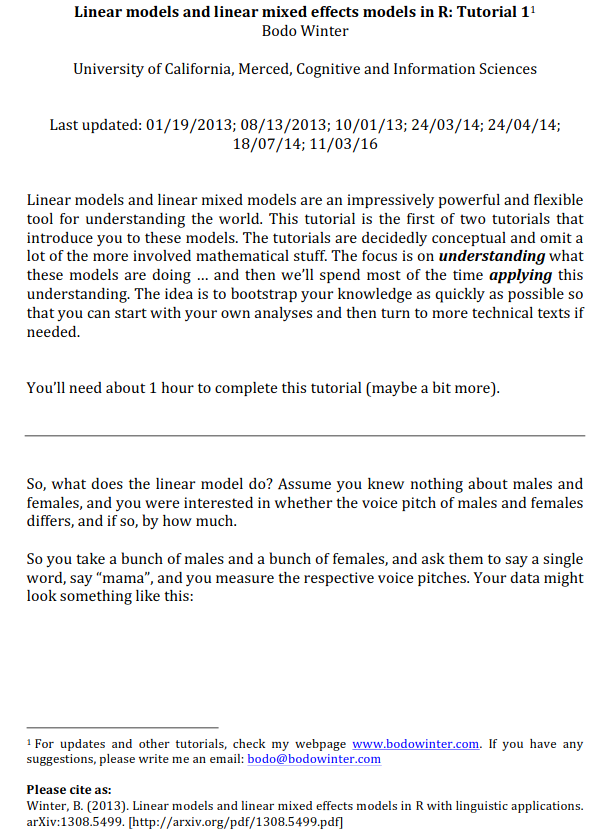
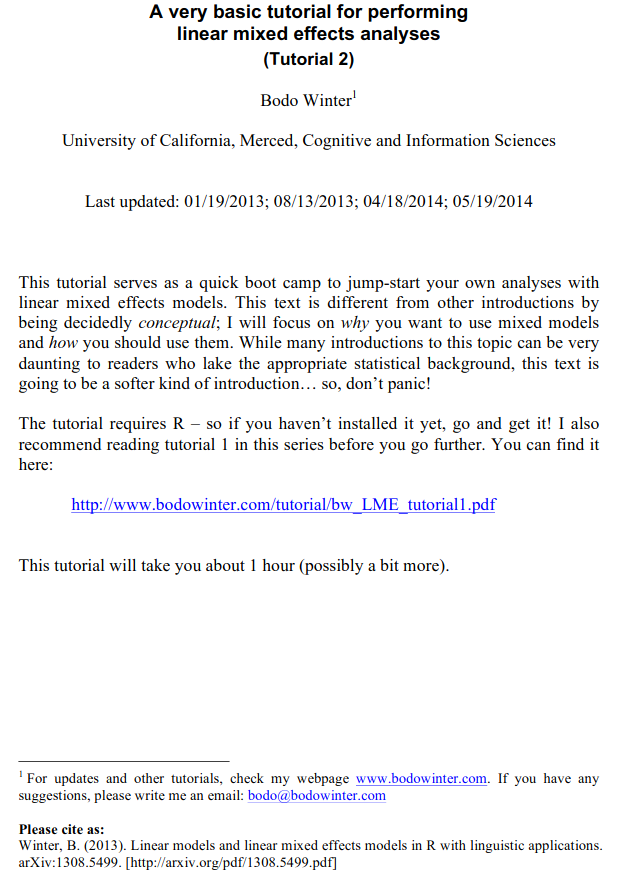

```{r setup, include=FALSE}
knitr::opts_chunk$set(echo = TRUE)
```

# Overview 

In this workshop we will take our first look at (generalised) linear mixed models (GLMMs or LMMs). The use of LMMs is becoming increasingly widespread across many aspect of the Psychological and Life Sciences in place of more traditional models (such as ANOVA) which are based on the general linear model. LMMs work by modelling individual data points (rather than aggregate data), can cope with unbalanced designed, missing data, a combination of categorical and continuous predictors, multiple random effects, participants and item covariates - and with GLMMs we can model data of different distribution types (e.g., data from the binomial distribution). The philosophy begind (G)LMMs is relatively straightforward and can be thought of as an extension of the general linear model. In this first video, I'll summarise the general linear model and then show how LMMs take things a little bit further.

<center>

&nbsp;&nbsp;

<iframe width="560" height="315" src="https://youtube.com/embed/6hirHdUIF_o" frameborder="0" data-external="1" allowfullscreen></iframe>

&nbsp;&nbsp;

</center>

## Slides

You can download the slides in .odp format by clicking [here](../slides/Mixed_Models_Part_1.odp) and in .pdf format by clicking on the image below. 

&nbsp;&nbsp;

<center>

[{width=75%}](../slides/Mixed_Models_Part_1.pdf)

</center>

&nbsp;&nbsp;

Once you've watched the video above, run the code below on your own machines.

## Linear Models Recap
### Predicting Height From Gender

```{r, message=FALSE}
library(tidyverse)
```

We first read in the datafile we need. We are also going to use `mutate()` to turn our `subject` and `gender` columns into factors.

```{r, message=FALSE}
gender_height_data <- read_csv("https://raw.githubusercontent.com/ajstewartlang/15_mixed_models_pt1/master/data/gender_height_data.csv")

gender_height_data <- gender_height_data %>%
  mutate(subject = factor(subject),
            gender = factor(gender))
```

Now let's plot our data. It's really important to do this before you build any models. You need to make sure the data look as you expect, and if you're trying to fit a linear model to your data it's important to be sure the relationship between your variables is roughly linear. Note, I've added a little bit of horizontal jitter to the plot.

```{r}
set.seed(1234)
gender_height_data %>%
  ggplot(aes(x = gender, y = height)) +
  geom_jitter(width = .1) +
  theme_minimal() +
  labs(x = "Gender", y = "Height (cm)") +
  scale_x_discrete(labels = c("Female", "Male"))
```

Now let's build a linear model using the `lm()` function and look at the parameter estimates using `summary()`.

```{r}
height_model <- lm(height ~ gender, data = gender_height_data)
summary(height_model)
```

We can see from this output that the mean height of our Females is 165 cm - this corresponds to the intercept of our model. To calculate the mean height of our Males, we add 12.5cm to our intercept of 165 (giving us 177.5 cm). We see from the t-test that the difference between these two groups is significant (*p* = 0.017).

### Predicting Height From Age 

Now let's look at a case where we have two continuous variables.

```{r, message=FALSE}
age_height_data <- read_csv("https://raw.githubusercontent.com/ajstewartlang/15_mixed_models_pt1/master/data/age_height_data.csv")
```

Let's plot our data.

```{r}
age_height_data %>%
  ggplot(aes(x = age, y = height)) +
  geom_point() +
  theme_minimal() +
  labs(x = "Age (years)", y = "Height (cm)")
```

The plot suggests there's a linear relaionship between our two variables. Let's build a linear model and examine the parameter estimates.

```{r}
age_model <- lm(height ~ age, data = age_height_data)
summary(age_model)
```

We can see that age is a significant predictor (*p* = .007). We interpret the parameter estimates slighly differently with continuous predictors compared to how we interpreted them when our predictor was categorical (as in the previous example). The intercept corresponds to someone's height when they are zero years old - which obviously makes no sense in this case. The model we've built really only captures the linear relationship between height and age for the age ranges we have data for. The relationship between height and age across the lifespan is obviously not linear! The estimate for age (2.398) should be interpreted as the increase in someone's height for every one year. So, for our dataset people tend to grow 2.398 cm per year.

For a further gentle introduction to (G)LMMs I recommend you have a look at these two great tutorial papers by Bodo Winter. Just click on the images below to access them.

&nbsp;&nbsp;

<center>

[{width=45%}](https://bodowinter.com/tutorial/bw_LME_tutorial1.pdf) [{width=45%}](https://bodowinter.com/tutorial/bw_LME_tutorial2.pdf)

</center>

&nbsp;&nbsp;

## Mixed Models
### One Factor Design With Two Levels

Imagine we are interested in how a person’s reaction time varies whether they’re responding to Large or Small target items. We observe the same 10 people each responding to 5 Large and 5 Small target items. We have 10 observations per person. These observations are not independent of each other as (which is an assumption of a linear model).

Imagine also that we have different Target Items (e.g., 10 different items that were presented in either in Large or Small format). Each Target Item might have been a little different. One particular Target might just be responded to more quickly (regardless of what condition it was in) - in other words, the Target Items will also have different baselines.

We'll be using the `{lme4}` package to build our models so let's load that first. Remember, if you haven't already installed `{lme4}` on your machine remember you need to first run in the Console `install.packages(lme4)`. We'll also load the `{lmerTest}` package to give us estimated *p*-values for our parameter estimates.

```{r, message=FALSE}
library(lme4)
library(lmerTest)
```

Let's read in our data and turn our `subject`, `item`, and `condition` columns into factors.

```{r, message=FALSE}
mixed_model_data <- read_csv("https://raw.githubusercontent.com/ajstewartlang/15_mixed_models_pt1/master/data/mixed_model_data.csv")

mixed_model_data <- mixed_model_data %>%
  mutate(subject = factor(subject),
            item = factor(item),
            condition = factor(condition))
```

And generate some descriptives.

```{r, message=FALSE}
mixed_model_data %>% 
  group_by(condition) %>%
  summarise(mean_rt = mean(rt), sd_rt = sd(rt))
```

We'll build our mixed model with `condition` as a fixed effect, and `subject` and `item` as random effects.

```{r}
mixed_model <- lmer(rt ~ condition + (1 | subject) + (1 | item), 
                    data = mixed_model_data)
summary(mixed_model)
```

We see from the above output that our Intercept parameter estimate is 854.140. This corresponds to the mean RT for the `Large` experimental condition. The estimate -49.780 corresponds to the difference in mean RT between the `Large` experimental condition and the `Small` experimental condition. In other words, people are 49ms faster in the `Small` condition relative to the `Large` condition. Note, in this example R is using dummy or treatment coding to code the levels of our condition. This is fine for a design with one factor, but becomes problematic when we have factorial designs involving interaction effects. For these kinds of designs we need to use *contrast* coding. We'll cover this later in more detail but it's worth noting at this point that the coding scheme you use can change how you interpret the parameter estimates. Many people get this wrong...

We can use the Likelihood Ratio Test (LRT) to determine whether our model containing our fixed effect of `condition` is better than a model that contains only the random effects. Note, you can only use the LRT when one model is a subset or (or nested within) the other. Let's build a model containing only our random effects. We'll call it `mixed_model_null`.

```{r}
mixed_model_null <- lmer(rt ~ (1 | subject) + (1 | item), 
                         data = mixed_model_data)
```

We can then compare the two models to each other via the LRT using `anova()`.

```{r, message=FALSE}
anova(mixed_model, mixed_model_null)
```

We can see the models differ from each other, with the `AIC`, `BIC`, and `deviance` measures all lower for the model with the fixed effect. This indicates that model with the fixed effect of `condition` explains more of the variability in our data than does the model with only random effects (and no fixed effect).

Let's now build a model which models the slopes of our random effects. This means we are allowing the difference between the two levels of our fixed effect to differ in magnitude from one participant to the next, and from one item to the next.

```{r}
mixed_model_slopes <- lmer(rt ~ condition + (1 + condition | subject)
                           + (1 + condition | item), data = mixed_model_data)
```

We can investigate the model parameter estimates using the `summary()` function.

```{r}
summary(mixed_model_slopes)
```
We can see that with a more complex random effect structure (i.e., random slopes as well as intercepts), the effect of our fixed effect of condition is still clearly there (and it is significant).

### One Factor With Three Levels

In this next video, I'll show you how to build a mixed model for a design where you have one experimental factor with three levels.

<center>

&nbsp;&nbsp;

<iframe width="560" height="315" src="https://youtube.com/embed/Y8hW9gdW8i0" frameborder="0" data-external="1" allowfullscreen></iframe>

&nbsp;&nbsp;

</center>

Once you've watched the video, run the code below on your own machines. 

Imagine we measured 24 subjects’ gaze duration while reading a sentence that appeared in one of three conditions - Negative, Neutral, and Positive. We had 24 items. The study is repeated measures (so everyone saw every condition).

```{r, message=FALSE}
tidied_factor_1_data <- read_csv("https://raw.githubusercontent.com/ajstewartlang/15_mixed_models_pt1/master/data/one_factor.csv")

tidied_factor_1_data <- tidied_factor_1_data %>%
  mutate(Subject = factor(Subject),
         Item = factor(Item),
         Condition = factor(Condition))
```

Let's plot our data.

```{r, message=FALSE}
tidied_factor_1_data %>%
  ggplot(aes(x = Condition, y = Gaze, colour = Condition)) +
  geom_violin(width = .5) +
  geom_jitter(width = .1, alpha = .1) +
  stat_summary(fun.data = "mean_cl_boot", colour = "black") +
  theme_minimal() +
  labs(x = "Condition",
       y = "Gaze Duration (ms.)") +
  guides(colour = "none") +
  coord_flip()
```

If we build the following model, we end up with a `singular fit` warning suggesting we are trying to estimate too many parameters than our data supports.

```{r}
factor_1_model <- lmer(Gaze ~ Condition + (1 + Condition | Subject) + 
                         (1 + Condition | Item), data = tidied_factor_1_data)
```

We can simplify the model by dropping random effect terms until the warning goes away and we have a set of parameter estimates we can be confident in.

```{r}
factor_1_model <- lmer(Gaze ~ Condition + (1 | Subject) + (1 | Item), 
                       data = tidied_factor_1_data) 
```

We can check the model assumptions using the `{performance}` package. Remember, we want to see the residuals (roughly) normally distributed.

```{r, warning=FALSE, message=FALSE}
library(performance)
check_model(factor_1_model)
```

These look pretty good to me.

We can generate the summary of the model.

```{r}
summary(factor_1_model)
```
In this case, the Intercept corresponds to the Negative condition - this is because we are still using R dummy coding of contrasts and the reference level is the condition that occurs first alphabetically. The estimates for `conditionNeutral` and `conditionPositive` involve a comparison of these two levels of our factor with the reference level (i.e., the Negative condition). We see that both levels of our factor differ from this reference level.

To determine whether *each* condition differs from each other condition, we can run pairwise comparisons using the `{emmeans}` package.

```{r, message=FALSE}
library(emmeans)
```

This is the same type of pairwise comparisons that we ran in the context of ANOVA. By default, Tukey correction is used for multiple comparisons.

```{r}
emmeans(factor_1_model, pairwise ~ Condition)
```

We can see with an appropriate correction for multiple comparisons (remember the familywise error rate?), that the *only* pairwise comparison that is significant is the Negative vs Positive condition comparison.

# Your Challenge

Within R, import the dataset “data1.csv” that can be found at:

`https://raw.githubusercontent.com/ajstewartlang/15_mixed_models_pt1/master/data/data1.csv`

These data are from a reaction time experiment. Fifty participants had to respond to a word on the screen. Their task was to press a button on a button box only when they recognized the word (our DV is measured in milliseconds). The words were either Rare or Common. The design is repeated measures. We might expect Common words to be recognized more quickly than Rare words. Run the appropriate LMM to determine whether this is indeed correct.

You should find a mixed model where RTs to the `Rare` condition are about 200 ms. slower than RTs to the `Common` condition, and this is a significant difference - so our prediction is supported. Did you remember to check the model assumptions?

## Improve this Workshop

If you spot any issues/errors in this workshop, you can raise an issue or create a pull request for [this repo](https://github.com/ajstewartlang/15_mixed_models_pt1). 